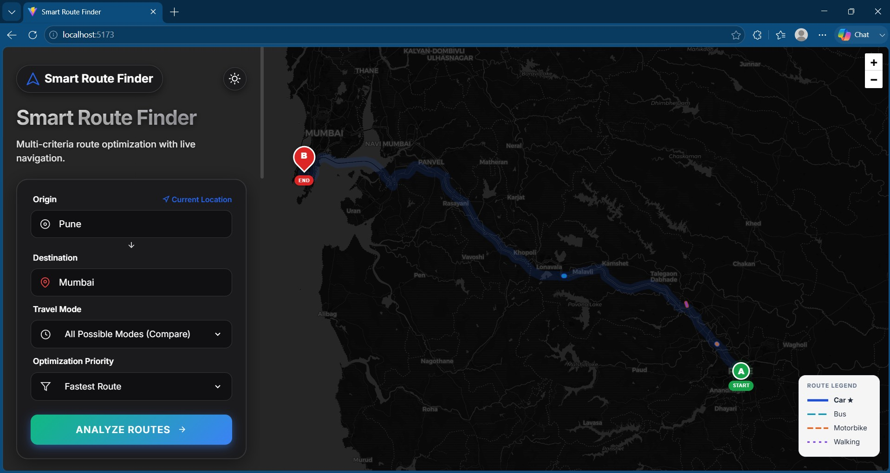
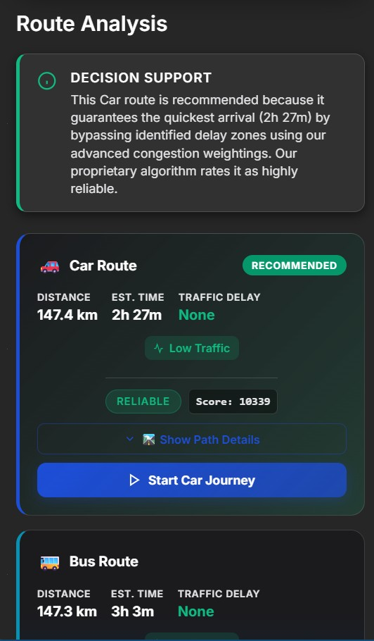
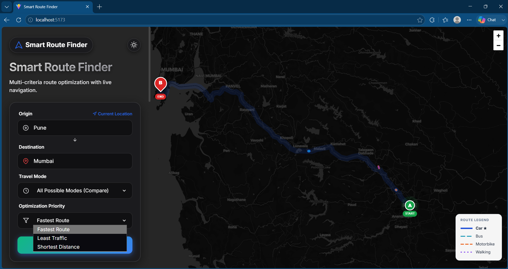
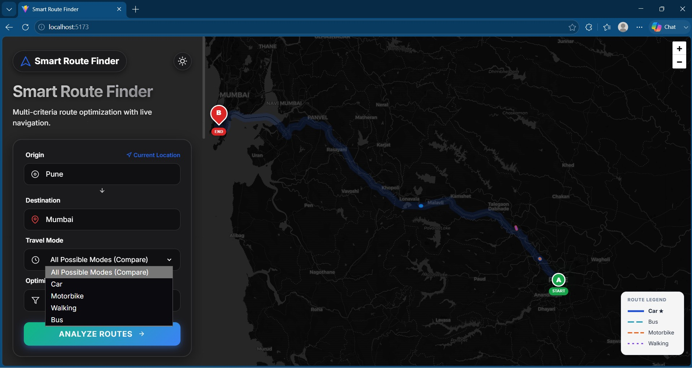
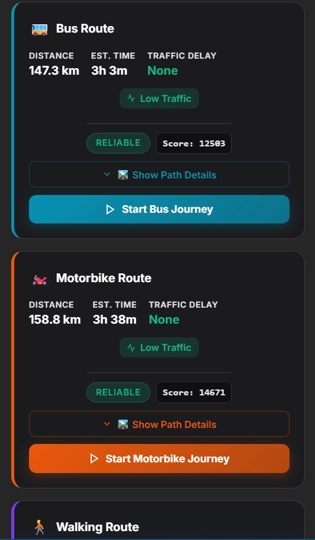

# 🚗 Smart Route Optimization & Traffic Analysis System

```{=html}
<p align="center">
```
``{=html}
```{=html}
</p>
```
```{=html}
<p align="center">
```


```{=html}
</p>
```
```{=html}
<p align="center">
```
An intelligent `<b>`{=html}Decision Support System (DSS)`</b>`{=html}
that analyzes multiple travel routes using the Google Maps Directions
API and recommends the optimal route based on distance, travel time,
traffic conditions, and weighted optimization.
```{=html}
</p>
```

------------------------------------------------------------------------

# 📖 Overview

Smart Route Optimization & Traffic Analysis System is a full-stack web
application that helps users compare multiple travel routes and
transportation modes before starting a journey.

Unlike traditional navigation systems that simply display routes, this
application evaluates available routes using a weighted decision
algorithm and recommends the most suitable route according to the
selected optimization priority.

------------------------------------------------------------------------

# 🏗 System Architecture

```{=html}
<p align="center">
```
``{=html}
```{=html}
</p>
```

------------------------------------------------------------------------

# ✨ Features

-   🌍 Real-time route analysis using Google Maps Directions API
-   🚗 Compare Car, Bus, Motorbike and Walking routes
-   📊 Fastest, Least Traffic and Shortest Distance optimization
-   🧠 Weighted Decision Support System
-   📈 Route ranking and reliability score
-   🗺 Interactive map visualization
-   🌙 Dark / Light mode interface
-   ⚡ REST API powered backend

------------------------------------------------------------------------

# 🛠 Technology Stack

  Technology                   Purpose
  ---------------------------- ----------------------
  React.js                     Frontend
  JavaScript (ES6+)            Programming Language
  Node.js                      Backend Runtime
  Express.js                   REST API
  Google Maps Directions API   Route Analysis
  Leaflet                      Interactive Maps
  Axios                        API Communication
  HTML5 / CSS3                 UI

------------------------------------------------------------------------

# 📂 Project Structure

``` text
smart-route-optimization-traffic-analysis-system
│
├── assets
│   ├── github-banner.png
│   ├── architecture-diagram.png
│   └── screenshots
├── backend
├── frontend
└── README.md
```

------------------------------------------------------------------------

# ⚙ Installation

``` bash
git clone https://github.com/shreyas-karanjkar/smart-route-optimization-traffic-analysis-system.git
cd smart-route-optimization-traffic-analysis-system

cd backend
npm install
node server.js

cd ../frontend
npm install
npm run dev
```

Create `backend/.env`

``` env
PORT=5000
GOOGLE_MAPS_API_KEY=YOUR_GOOGLE_MAPS_API_KEY
```

------------------------------------------------------------------------

# 📸 Application Demo

Rename your screenshots exactly as:

``` text
assets/screenshots/
├── dashboard.jpg
├── decision-support.jpg
├── optimization-priority.jpg
├── travel-modes.jpg
└── route-comparison.jpg
```

## Dashboard



## Decision Support



## Optimization Priority



## Travel Modes



## Route Comparison



------------------------------------------------------------------------

# 🚀 Future Improvements

-   AI-based route recommendation
-   Historical traffic analytics
-   Weather-aware route planning
-   User authentication
-   Saved routes
-   Multi-stop optimization

------------------------------------------------------------------------

# 👨‍💻 Author

**Shreyas Karanjkar**

M.Tech (Computer Science & Engineering)

VIT Vellore

------------------------------------------------------------------------

⭐ If you found this project useful, consider giving it a star.
